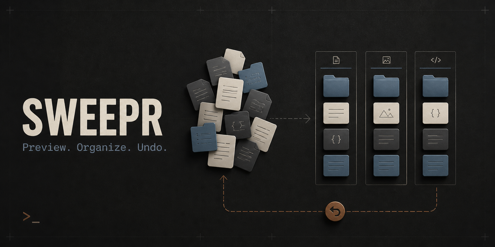

<div align="center">



# sweepr

**Smart, safe, and reversible terminal file organizer.**

[](https://github.com/amandeavor/Sweepr/releases)
[](https://www.python.org/)
[](https://github.com/amandeavor/Sweepr/actions/workflows/ci.yml)
[](LICENSE)
[](https://pipx.pypa.io/)
[](https://github.com/astral-sh/ruff)

<p align="center">
  <a href="#quickstart">Quickstart</a> •
  <a href="#key-features">Features</a> •
  <a href="#cli-command-reference">Commands</a> •
  <a href="#safety-model">Safety Model</a> •
  <a href="#contributing">Contributing</a>
</p>

</div>

---

> **Status:** Usable v0.1.x release. Dry-run is the default, and applied operations include an undo manifest.

`sweepr` is a fast, terminal-native file organizer designed for cluttered directories like `~/Downloads` and `~/Desktop`. It previews every single action in high-contrast Rich tables before touching a file, sorts files intelligently by category or modification date, and generates cryptographic JSON manifests so any operation can be instantly undone.

**Dry-run is the default.** Files are moved only when you explicitly pass `--apply`.

```
$ sweepr organize ~/Downloads --by-type
╭─────────────────────────────────────────────────────────────────────────────╮
│ Sweepr Dry Run: /Users/aman/Downloads                                       │
╰─────────────────────────────────────────────────────────────────────────────╯
┌───────────────────────┬────────────┬─────────────┬──────────────────────────┐
│ Source File           │ Size       │ Category    │ Destination Target       │
├───────────────────────┼────────────┼─────────────┼──────────────────────────┤
│ quarterly_report.pdf  │ 2.4 MB     │ Documents   │ Documents/quarterly_rep… │
│ prototype_mockup.png  │ 4.1 MB     │ Images      │ Images/prototype_mockup… │
│ recording_demo.mp4    │ 48.2 MB    │ Videos      │ Videos/recording_demo.m… │
│ dataset_backup.tar.gz │ 128.0 MB   │ Archives    │ Archives/dataset_backup… │
└───────────────────────┴────────────┴─────────────┴──────────────────────────┘
Scan complete: 4 files identified across 4 categories (0 moved, dry-run).
Pass --apply to execute this sweep.
```

---

## Key Features

| Capability | Description |
| :--- | :--- |
| **Smart Classification** | Automatically categorizes into `Images`, `Documents`, `Videos`, `Audio`, `Archives`, `Code`, `Data`, `Spreadsheets`, `Presentations`, and `Books`. |
| **Timeline Sorting** | Organizes cluttered photo dumps and logs chronologically into `YYYY/MM/` directories. |
| **Zero-Risk Previews** | High-density terminal tables show exact source paths, targets, and file sizes before moving anything. |
| **Atomic Undo** | Every applied run generates a local `.sweepr/<timestamp>.json` manifest. Run `sweepr undo <dir>` to reverse any sweep. |
| **Collision Protection** | Never overwrites existing files. Automatically suffixes conflicting names (`report (1).pdf`). |
| **Nested Scanning** | Deeply inspect nested subfolders with `--recursive` while preserving directory trees. |

---

## Quickstart

### 1. Install

Install with `pipx` (isolated virtual environment):

```bash
pipx install git+https://github.com/amandeavor/Sweepr.git
```

Or install from source:

```bash
git clone https://github.com/amandeavor/Sweepr.git
cd Sweepr
pip install -e .
```

### 2. Run a safe preview

```bash
sweepr organize ~/Downloads --by-type
```

### 3. Apply changes and undo if needed

```bash
# Apply organization
sweepr organize ~/Downloads --by-type --apply

# Undo the sweep anytime
sweepr undo ~/Downloads
```

---

## CLI Command Reference

### `sweepr organize`

Organizes files within the specified directory.

```bash
sweepr organize <PATH> [OPTIONS]
```

| Flag | Type | Description |
| :--- | :--- | :--- |
| `<PATH>` | `Directory` | Target directory to organize *(default: current directory)*. |
| `--by-type` | `Flag` | Categorize files by extension into standard category directories. |
| `--by-date` | `Flag` | Group files chronologically into `YYYY/MM/` folders based on modification time. |
| `--apply` | `Flag` | Execute file moves. Without this flag, a dry-run preview is generated. |
| `--recursive` / `-r` | `Flag` | Scan and organize nested subdirectories. |

### `sweepr undo`

Reverts the most recent sweep executed in the target directory using saved metadata manifests.

```bash
sweepr undo ~/Downloads
```

### `sweepr types`

Displays all known file extensions and their mapped categories.

```bash
sweepr types
```

---

## Safety Model

`sweepr` prioritizes file safety above all else:

1. **Non-Destructive Defaults**: Runs in `--dry-run` mode unless `--apply` is explicitly given.
2. **Conflict Avoidance**: If `Documents/notes.txt` already exists, incoming files are renamed to `Documents/notes (1).txt`.
3. **Internal Exclusions**: Automatically skips `.sweepr` metadata, hidden system files, and symbolic links to prevent broken links.
4. **Safe Reverse Mapping**: During `undo`, if a new file has taken the original path in the meantime, Sweepr refuses to overwrite it and alerts the user.

---

## Development & Testing

```bash
# Setup virtual environment
python -m venv .venv
source .venv/bin/activate  # On Windows: .venv\Scripts\Activate.ps1

# Install development dependencies
pip install -e ".[dev]"

# Run test suite
pytest

# Run linting and formatting checks
ruff check .
ruff format --check .
```

---

## Community & Governance

- [Contributing Guide](CONTRIBUTING.md)
- [Security Policy](SECURITY.md)
- [Code of Conduct](CODE_OF_CONDUCT.md)
- [Governance & Roles](GOVERNANCE.md)
- [Project Roadmap](ROADMAP.md)
- [Support Guidelines](SUPPORT.md)
- [Changelog](CHANGELOG.md)

---

## License

This project is licensed under the [MIT License](LICENSE).
